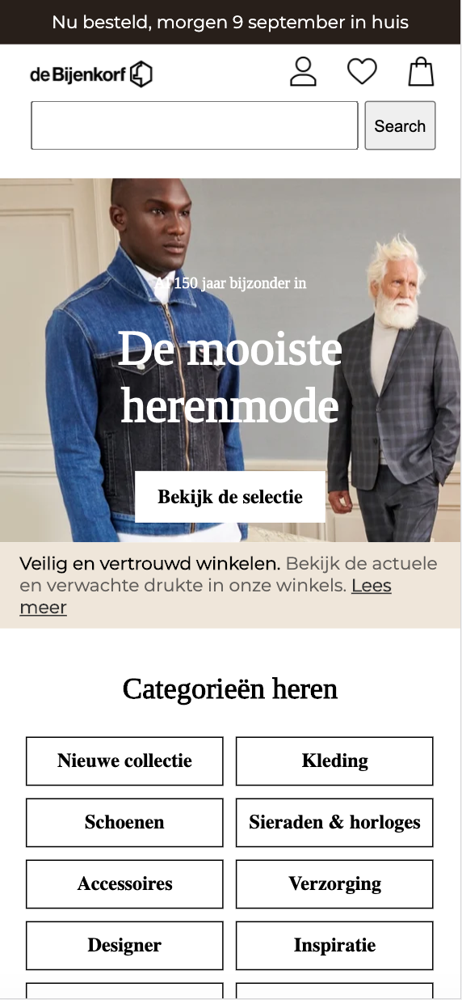
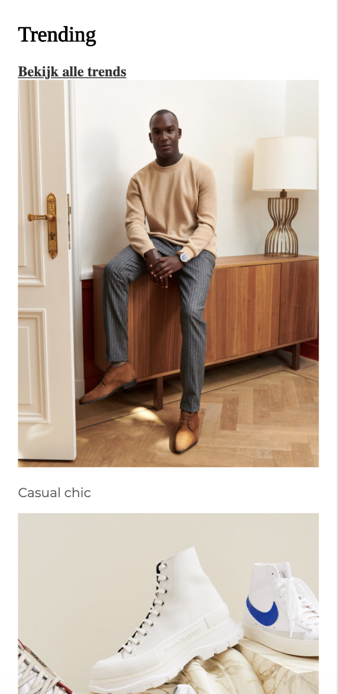
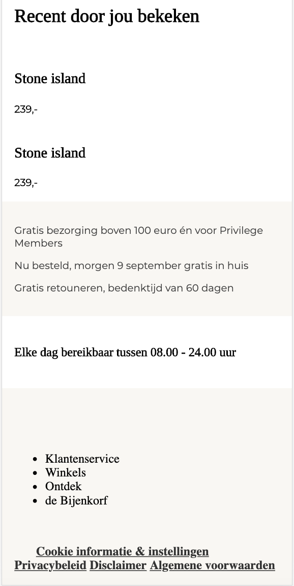
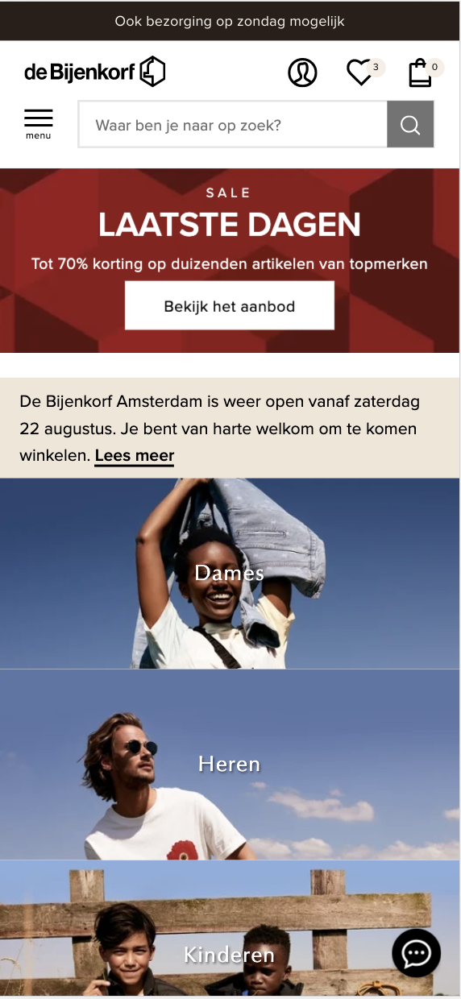
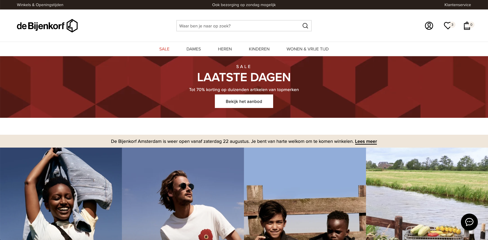
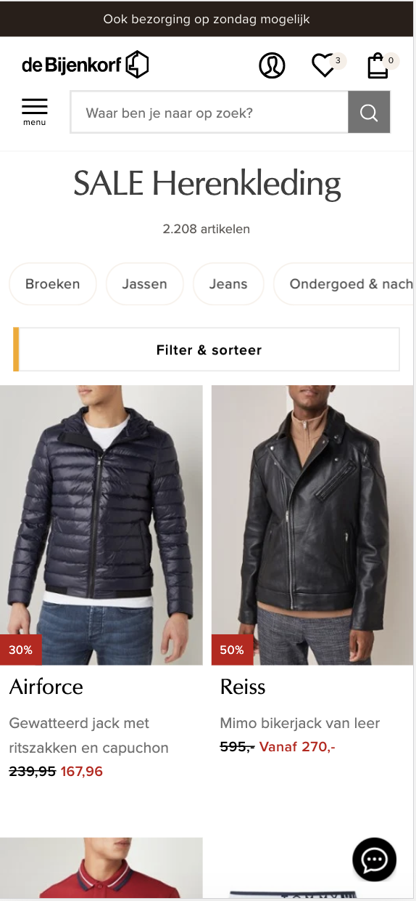
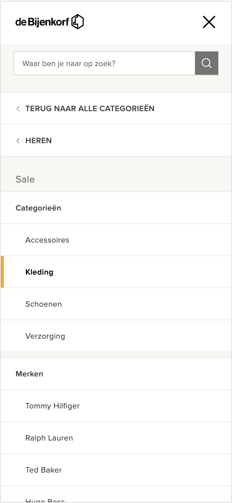

# Procesverslag
**Auteur:** Jelle Kitzen

Markdown cheat cheet: [Hulp bij het schrijven van Markdown](https://github.com/adam-p/markdown-here/wiki/Markdown-Cheatsheet). Nb. de standaardstructuur en de spartaanse opmaak zijn helemaal prima. Het gaat om de inhoud van je procesverslag. Besteedt de tijd voor pracht en praal aan je website.

## Bronnenlijst
1. -bron 1-
2. -bron 2-
3. -...-

## Eindgesprek (week 7/8)

-dit ging goed & dit was lastig-

**Screenshot(s):**

-screenshot(s) van je eindresultaat-

## Voortgang 3 (week 6)

-same as voortgang 1-

## Voortgang 2 (week 5)

-same as voortgang 1-

## Voortgang 1 (week 3)

### Stand van zaken

Tot nu toe ging alles vrij soepel. Ik heb wel gemerkt dat ik het moeilijk vind om de opdrachten te maken terwijl ik eigenlijk verder wil met mijn website.

Ik probeer nu delen te maken van de opdracht, als ik vast loop dan pak ik uiteraard de odprachten er bij.

**Screenshot(s):**

### Agenda voor meeting

- Hoe we kunnen zorgen dat website zo responsive mogelijk worden?

- Moeten we het hamburger menu laten werken?

- Hoe kan je met 2 html pagina's en 1 css ervoor zorgen dat de nth-of-typ(n) goed werkt, want bvb de eerste p op de ene html moet bold worden, maar de eerste p op de andere html moet niet bold worden.

- Hoe kan je een carousel maken

- 

### Verslag van meeting

-na afloop snel uitkomsten vastleggen-

## Intake (week 1)

**Je startniveau:** Rood/Zwart (lichte twijfel)

**Je focus:** Responsive

**Je opdracht:** https://www.debijenkorf.nl

**Screenshot(s):**

**Breakdown-schets(en):**

